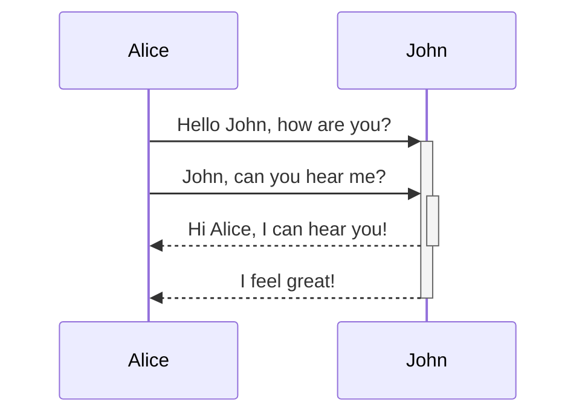

# Demo


```csharp
class MyClass {
  public int Data { get; set; }
}
```

---


```mermaid
sequenceDiagram
    Alice->>+John: Hello John, how are you?
    Alice->>+John: John, can you hear me?
    John-->>-Alice: Hi Alice, I can hear you!
    John-->>-Alice: I feel great!

```

[mermaid live](https://mermaid.live/)
